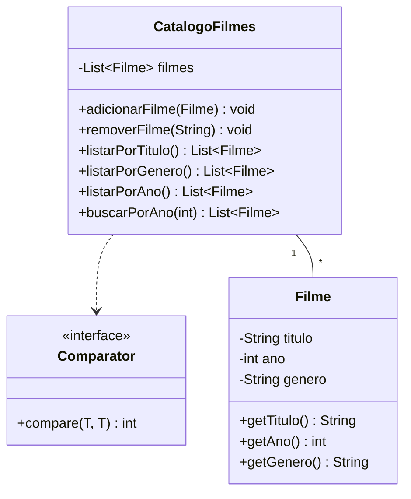
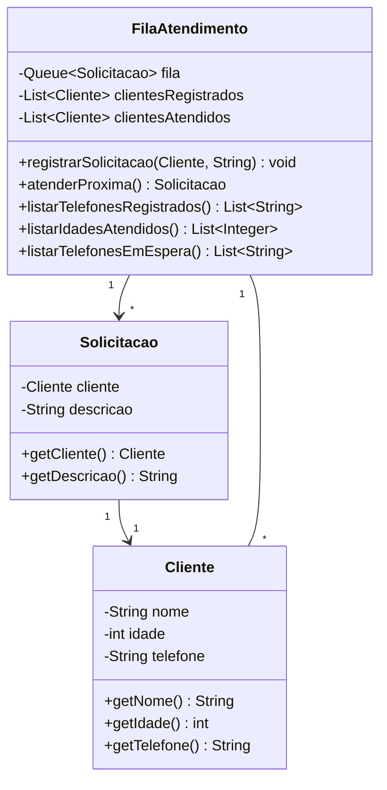

```mermaid
classDiagram
    class Filme {
        -String titulo
        -int ano
        -String genero
        +getTitulo() String
        +getAno() int
        +getGenero() String
    }

    class CatalogoFilmes {
        -List~Filme~ filmes
        +adicionarFilme(Filme) void
        +removerFilme(String) void
        +listarPorTitulo() List~Filme~
        +listarPorGenero() List~Filme~
        +listarPorAno() List~Filme~
        +buscarPorAno(int) List~Filme~
    }

    class Comparator {
        <<interface>>
        +compare(T, T) int
    }

    CatalogoFilmes ..> Comparator
    CatalogoFilmes "1" -- "*" Filme 
```

```mermaid
classDiagram
    class Cliente {
        -String nome
        -int idade
        -String telefone
        +getNome() String
        +getIdade() int
        +getTelefone() String
    }

    class Solicitacao {
        -Cliente cliente
        -String descricao
        +getCliente() Cliente
        +getDescricao() String
    }

    class FilaAtendimento {
        -Queue~Solicitacao~ fila
        -List~Cliente~ clientesRegistrados
        -List~Cliente~ clientesAtendidos
        +registrarSolicitacao(Cliente, String) void
        +atenderProxima() Solicitacao
        +listarTelefonesRegistrados() List~String~
        +listarIdadesAtendidos() List~Integer~
        +listarTelefonesEmEspera() List~String~
    }

    FilaAtendimento "1" --> "*" Solicitacao 
    Solicitacao "1" --> "1" Cliente 
    FilaAtendimento "1" -- "*" Cliente 
```

